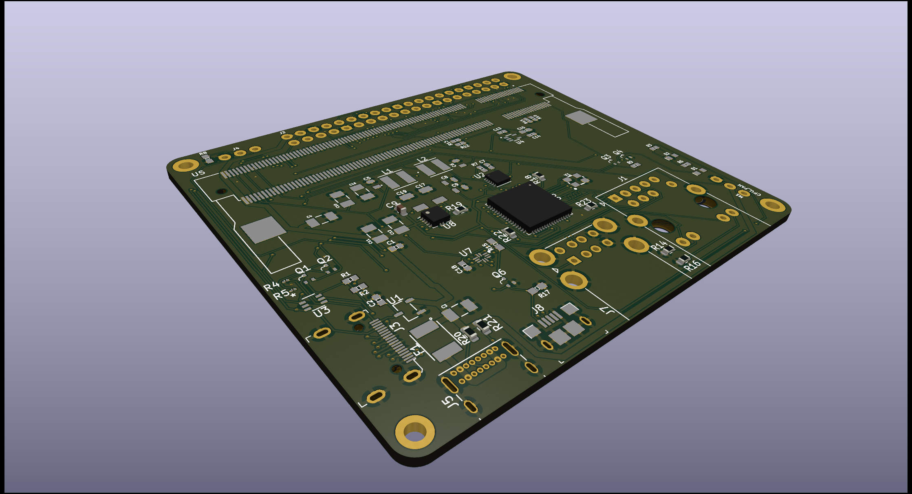

# CMIOBoard
A tiny, compact IO board for the raspberry compute modules 1/3/3+

## Features:
IO Ports:  
* USB-C (Power/USB 2.0)
* HDMI
* USB-Micro B (Slave port)
* Dual-USB-A 2.0
* Ethernet

Other:
* Three pin 5V fan header
* Three pin boot selector
* 40 pin standard Raspberry Pi GPIO
* 4x2.2mm mounting holes
* Power LED (Red)
* Boot LED (Green)

## Dimensions:
99.06mm x 52.5mm  
5.84mm radius rounded corners
5.33mm diameter mounting holes (M2 or US #1/2 screws)  
88.13 center distance between horizontal mounting holes.  
41.14 center distance between vertical mounting holes.  
## Important!
The Raspberry Pi Compute Module requires a 5v, 2+ Amp power supply. (5.1V Recommended)

*License: GNU General Public License v3.0*  
*[gnu.org/licenses/gpl-3.0](https://www.gnu.org/licenses/gpl-3.0.en.html)*
