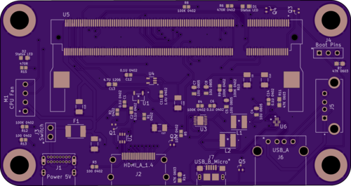

# CMIOBoard
A tiny, compact IO board for the raspberry compute modules 1/3/3+

*A top down view to the board without components.*

*The bottom of the board.*

## Features:
IO Ports:
1. USB-C (Power only)
2. HDMI
3. USB-Micro B (Slave port)
4. USB-A

Internal Ports:
1. 4-pin PWM 5v Fan header
2. 3-pin boot selection
3. 2-pin On/Off switch header
4. Vertical USB-A (Duplicate of the USB-A IO port)

Status LEDs:
1. Power LED (Red)
2. Boot LED (Green)

## Dimensions:
99.06mm x 52.5mm

5.84mm radius rounded corners

5.33mm diameter mounting holes (10-32 screws)

88.13 center distance between horizontal mounting holes.

41.14 center distance between vertical mounting holes.

## Important!
The Raspberry Pi Compute Module requires a 5v, 2+ Amp power supply. (5.1V Recommended)

## Todo:
1. Get PCB and Parts, then assemble & take pictures for README
2. Organize a BOM with DikiKey product numbers
3. Design case with support for a 40mm fan, 10-32 mounting screws, a power switch, and an additional USB-C port.

## Issues:
No known issues at this time.
