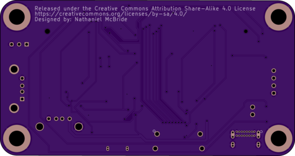

# CMIOBoard
A tiny, compact IO board for the raspberry compute modules 1/3/3+

 

## Features:
IO Ports:  
1. USB-C (Power only)
2. HDMI
3. USB-Micro B (Slave port)
4. USB-A

Internal Ports:  
1. 4-pin PWM 5v Fan header
2. 3-pin boot selection
3. 2-pin On/Off switch header
4. Vertical USB-A (Duplicate of the USB-A IO port)

Status LEDs:  
1. Power LED (Red)
2. Boot LED (Green)

## Dimensions:
99.06mm x 52.5mm  
5.84mm radius rounded corners  
5.33mm diameter mounting holes (10-32 screws)  
88.13 center distance between horizontal mounting holes.  
41.14 center distance between vertical mounting holes.  
## Important!
The Raspberry Pi Compute Module requires a 5v, 2+ Amp power supply. (5.1V Recommended)

## Todo:
1. Redo the entire project with good schematic and PCB design practices!
2. Design case with support for a 40mm fan, 10-32 mounting screws, and a power switch.
3. Add dedicated Ethernet.
4. Expand USB selection to Dual USB-A, and USB-C with data.
5. Add small, dedicated GPIO pins with 5V, 3V3, 1V8, and GND pins.
6. Power over Ethernet
7. Add JTAG functionality
8. Probe Points for debugging
9. Readd 0 ohm resistors from Raspberry Pi Foundantion schematics

*License: GNU General Public License v3.0*  
*[gnu.org/licenses/gpl-3.0](https://www.gnu.org/licenses/gpl-3.0.en.html)*
